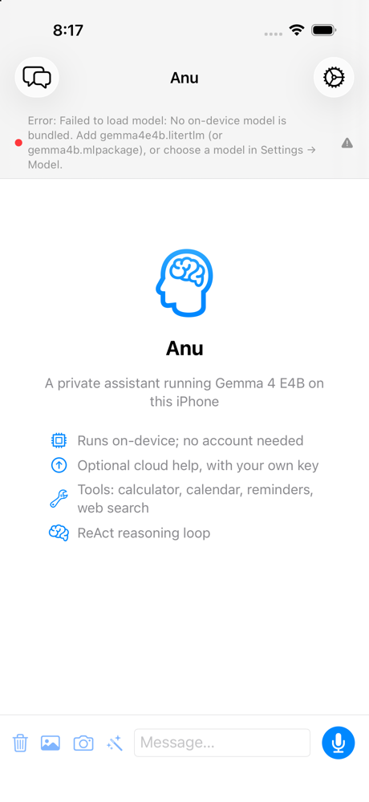
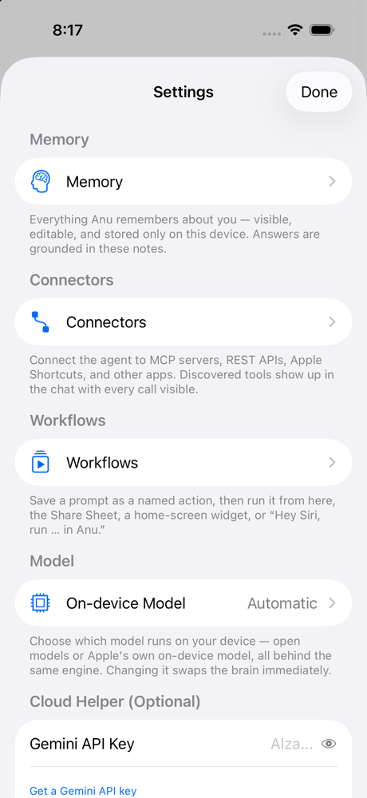
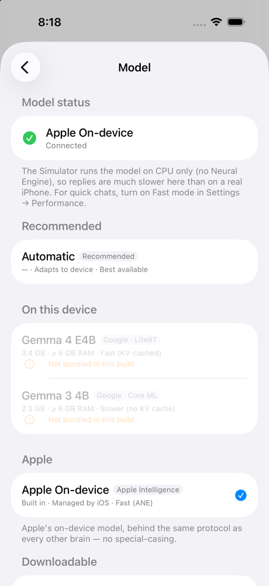

# Anu: on-device agentic AI for iOS

[](https://github.com/sandeepvijayarao09/Anu-iOS/actions/workflows/ci.yml)
[](LICENSE)


A voice-first iOS assistant whose brain is **Gemma 4 E4B running on the device** (Google's
LiteRT engine), with an on-device router that decides, per message, what kind of task it is
and which model and tools should handle it. Private by default; the cloud is an optional,
PII-scrubbed fallback that uses your own key.

<p>
  
  
  
</p>

<sub>iOS 26.5 Simulator, built from a clean clone with no model file. The app says so
instead of faking answers; Apple's on-device model can be picked as the brain instead.</sub>

> **Status:** prototype. Builds from a clean clone; 317 unit tests run green in
> [CI](https://github.com/sandeepvijayarao09/Anu-iOS/actions/workflows/ci.yml) on every push
> (plus 4 real-model tests that are skipped without a model). There is no in-app model
> download yet: you place the model file yourself (below). The Android sibling,
> Android_ANU, is the more mature codebase.

---

## What it does

```
        ┌─ 🎤 voice (primary)
 input ─┼─ 🖼️ image          ┐
        └─ ⌨️ text           │
                             ▼
        ┌──────────────────────────────────────────────┐
        │  On-device decisions (no network, no model    │
        │  round-trip):                                 │
        │   1. TaskClassifier  — NLEmbedding nearest-    │
        │      centroid → casual / math / web / code /   │
        │      writing / QA  (91.7% on a 60-case eval)   │
        │   2. ModelClassifier — task + confidence +     │
        │      cloud-availability → a route              │
        │   +  Memory layer    — relevant saved notes    │
        │      injected as [M#] ground-truth sources     │
        └──────────────────────────────────────────────┘
                             ▼
   ┌─────────────────┬──────────────────────┬─────────────────────┐
   │ on-device CHAT  │ on-device AGENT       │ CLOUD (optional)    │
   │ warm persona,   │ ReAct loop + tools    │ Gemini, PII-scrubbed│
   │ fast, no tools  │ (calculator, search)  │ for heavy gen only  │
   └─────────────────┴──────────────────────┴─────────────────────┘
                             ▼
          Gemma 4 E4B (LiteRT)  ·  streamed, cancellable
```

### Highlights

- **On-device brain** — Gemma 4 E4B via LiteRT/MediaPipe (`.litertlm`), a fresh
  session per turn with a bounded conversation window. Core ML Gemma 3 4B is a
  secondary fallback, and Apple's on-device Foundation model can be selected instead.
- **Two on-device classifiers** — a task classifier (Apple `NLEmbedding`
  sentence embeddings) and a model classifier route every message before any
  generation. Confidence-gated; low confidence falls back to the agent loop.
- **ReAct agent loop** — calculator, web search, and a Gemini-escalation tool,
  with structured `{"tool_call": …}` parsing and a visible reasoning trace.
- **Voice-first** — `SFSpeechRecognizer` on-device dictation; the mic is the
  primary control and auto-sends on stop.
- **Multimodal** — attach an image; it feeds E4B's native vision encoder.
- **Editable memory (NotebookLM-style)** — saved notes are *sources*. They're
  visible/editable in Settings, retrieved by embedding similarity, layered onto
  every prompt as numbered `[M#]` ground truth, and cited in the trace.
- **Privacy** — API keys in Keychain; on-device-only speech; two-layer PII
  scrub before any cloud call; memory never leaves the device.
- **Production posture** — no mock in the product (a missing model is an
  explicit error); cancellation; tool timeouts; conversation persistence;
  Siri/Shortcuts via App Intents.

---

## Siri AI parity (WWDC 2026)

Every Siri-AI capability a sandboxed App Store app can ship on the iOS 26.5 SDK,
matched with real on-device APIs — and an honest line on what it can't be.

- **Conversational, spoken Siri** — `AskAnuInlineIntent` returns an inline
  answer Siri reads aloud (`ReturnsValue` + `ProvidesDialog`); `SpeechSynthesizer`
  (`AVSpeechSynthesizer`, "Speak Responses" in Settings → Voice) reads replies
  aloud in-app, completing the talk-in / talk-back loop. `StartVoiceIntent`
  ("Talk to Anu") is a one-tap Action Button / Siri target that opens straight
  into listening.
- **Visual Intelligence** — `CameraCaptureView` (AVFoundation) point-and-ask:
  a captured frame flows into the same on-device vision pipeline as a picked
  photo.
- **Image generation** — `ImageGenerationTool` uses Apple's `ImageCreator`
  (Image Playground, iOS 18.4+) so the agent can "draw" on request; a manual
  Image Playground sheet (`wand.and.stars` button) drops a result into chat.
- **Writing Tools** — `SummarizeTextIntent` / `RewriteTextIntent` /
  `ProofreadTextIntent` run on-device through the shared
  `AgentOrchestrator.completeHeadless` and work from Siri, Shortcuts, and the
  selection menu. (Apple's system Writing Tools also attach to the text field
  for free on AI-eligible devices.)
- **Proactivity / personal context** — `SpotlightIndexer` (CoreSpotlight) makes
  saved Workflows searchable and surfaces them as Siri Suggestions; App Intents
  donate the actions themselves.

**Parity boundary (not faked).** A third-party app cannot *be* the system
assistant: being the "Hey Siri" default, on-screen awareness across *other* apps
(the iOS 27 **View Annotations** API — not in the installed 26.5 SDK), Safari/
password/system control, and OS-level personal-context indexing are Apple-only.
Those are deliberately out of scope rather than stubbed. Where Anu goes
further than Siri: fully on-device by default, a swappable brain (incl. Apple's
own Foundation model), open MCP/REST connectors, and a glass-box reasoning trace.

> Device boundary: camera capture, Image Playground generation, Apple Writing
> Tools, and Siri spoken results need a real Apple-Intelligence device; the
> Simulator verifies compile, intent registration, the speak toggle, and the
> graceful "unavailable" paths.

---

## Project structure

```
Sources/Anu/
├── App/        AnuApp, ContentView, AskAnuIntent, WritingIntents (Siri/Shortcuts)
├── Agent/      AgentOrchestrator (+Modes, +Sessions), TaskClassifier,
│               ModelClassifier, MessageRouter, EscalationRouter, Planner,
│               Critic, PlanGate, MemoryStore, PrivacyLedger, ConversationWindow
├── Models/     LiteRTGemmaModel (primary), GemmaModel (Core ML fallback),
│               FoundationModelBackend (Apple), PrivateCloudModel, ModelManager,
│               ScriptedModel (DEBUG-only test double), tokenizers, ModelConfig
├── Tools/      Tool protocol + registry; calculator, date/time, unit converter,
│               calendar, reminders, contacts, web search, image generation,
│               Gemini / private-cloud escalation
├── Connectors/ MCP client + registry, OAuth, REST connectors, app launcher
├── API/        GeminiClient, PrivateComputeClient
├── Workflows/  saved prompts, App Group store, RunWorkflowIntent
├── UI/         ChatView, AgentTraceView, MemoryView, ConnectorsView,
│               ModelManagerView, PrivacyView, SettingsView, …
└── Utilities/  KeychainStore, PIISanitizer, Conversation/SessionStore,
                SpeechRecognizer/Synthesizer, StreamStopFilter, StreamParser
```

`ModelFactory` selects the backend at launch: **LiteRT E4B → Core ML Gemma 3 4B
→ `UnavailableModel`** (an explicit error — there is no silent fake). A
DEBUG-only `ScriptedModel`, reachable solely via the `-scripted_model` launch
argument, backs the UI tests.

---

## Build & run

The project is generated by a script and uses CocoaPods (for MediaPipe), so the
workflow is: **download a model → generate the project → `pod install` → open
the workspace.**

### 1. Get the model

The model blobs are git-ignored (they're multi-GB). Download Google's official
on-device build and place it in `Anu/`:

```bash
pip install huggingface-hub
python - <<'PY'
from huggingface_hub import hf_hub_download
import shutil
p = hf_hub_download("litert-community/gemma-4-E4B-it-litert-lm",
                    "gemma-4-E4B-it.litertlm")
shutil.copy(p, "Anu/gemma4e4b.litertlm")
print("placed Anu/gemma4e4b.litertlm")
PY
```

(Optional Core ML fallback, **iOS 18+ only** — the int4 `.mlpackage` uses
per-block quantization that Core ML loads only on iOS 18+. Convert Gemma 3 4B
with `Scripts/convert_gemma_coreml.py` and drop `gemma4b.mlpackage` +
`tokenizer.json` into `Anu/`. On iOS 17 the app runs LiteRT only; if no
LiteRT model is present it shows an explicit "no model" error rather than
loading the incompatible package.)

### 2. Generate the project and install pods

```bash
python3 generate_xcodeproj.py   # picks up whatever models are present
LANG=en_US.UTF-8 pod install
```

`generate_xcodeproj.py` is the source of truth for the Xcode project; re-run it
after adding files or models. The committed `Anu.xcodeproj` / `Anu.xcworkspace`
are its model-free output (plus `pod install`), so a fresh clone builds without any
model. After you add a model and regenerate, don't commit the project changes.

### 3. Open and run

```bash
open Anu.xcworkspace   # NOT the .xcodeproj — CocoaPods needs the workspace
```

- Set your Team under **Signing & Capabilities**.
- Run on a **physical iPhone** (15 Pro / 16 / 17 class) for usable speed — the
  Simulator runs inference CPU-only and is much slower.
- (Optional) add a Gemini API key in **Settings → Cloud Helper** to enable the
  cloud route for heavy code/writing tasks.

---

## Testing

```bash
xcodebuild -workspace Anu.xcworkspace -scheme Anu \
  -destination 'platform=iOS Simulator,name=iPhone 17 Pro,OS=26.5' \
  -only-testing:AnuTests -collect-test-diagnostics never \
  CODE_SIGNING_ALLOWED=NO test
```

317 unit tests (the same command CI runs): tool-call parsing, calculator
(including NaN/Inf/overflow/arity regressions), classifiers with a
`ClassifierEvalTests` accuracy harness (91.7%, 55 of 60 cases, on the task eval;
70% floor), tokenizer, stream stop-filter, PII scrubbing, Keychain migration,
memory store and retrieval, MCP/REST connectors, planner/critic, and the full
orchestrator ReAct loop. Keychain-backed code uses an in-memory secret backend
under XCTest, so the suite needs no signing; set `ANU_TEST_REAL_KEYCHAIN=1` on a
signed host to test against the real Keychain. Four real-model tests are skipped
unless a model is bundled (`REAL_MODEL_TEST=1`).

`-collect-test-diagnostics never` matters: without it xcodebuild waits ten
minutes after the tests finish. The 17 XCUITests in `UITests/` drive the chat
flow against the DEBUG-only scripted model and run locally only.

---

## Notes

- Swift 6 structured concurrency throughout (actor-isolated model backends,
  `@MainActor` orchestrator as single source of truth, `AsyncStream`
  cancellation wired to per-backend stop).
- No third-party Swift dependencies beyond MediaPipe (LiteRT runtime).
- The model is unchanged Google weights; the engineering is in the harness.
  Conversion notes are in `Scripts/convert_gemma_coreml.py` and
  [Docs/ARCHITECTURE.md](Docs/ARCHITECTURE.md).
